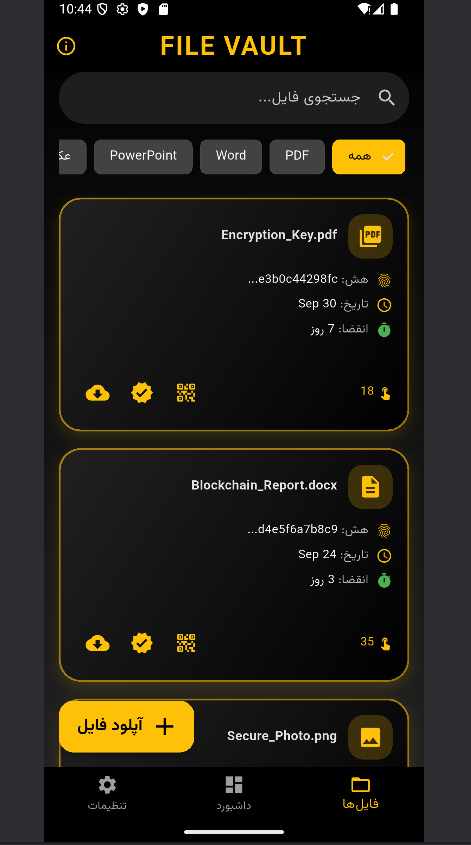
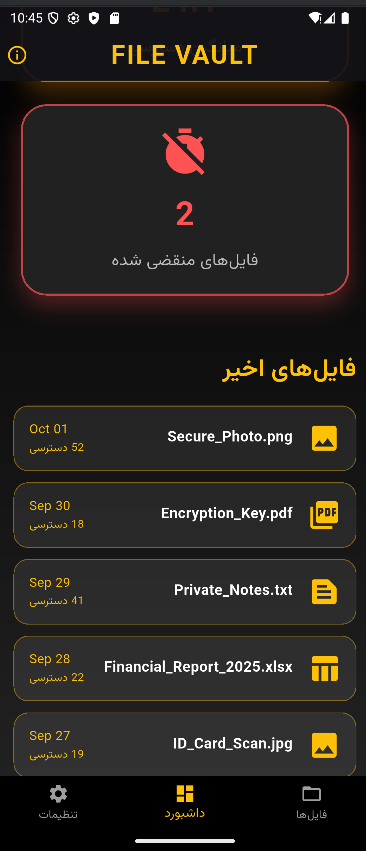
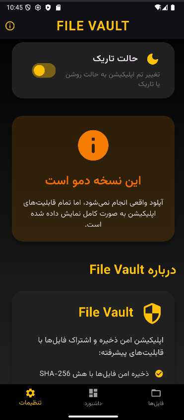

# File Vault 🛡️

**Secure File Storage & Sharing App built with Flutter**

File Vault is a modern, elegant, and fully functional demo application for securely managing and sharing files. It showcases advanced Flutter capabilities while providing a polished user experience with full Persian (Farsi) language and RTL support.


## 📸 Screenshots

<div align="center">
  <h4>🏠 Project Images</h4>

  <table>
    <tr>
        <td></td>
        <td></td>
    </tr>
    <tr>
         <td></td>
         <td></td>
    </tr>
  </table>
</div>


## ✨ Features

- **File Integrity Verification** – Automatic SHA-256 hash calculation
- **Secure Sharing** – Generate shareable links with optional password and expiration date
- **QR Code Generation** – Instant QR codes for easy link sharing
- **Official PDF Certificates** – Beautiful, printable certificates with full file details
- **Advanced Analytics Dashboard** – Track total files, access counts, average views, and expired files
- **Smart Search & Filter** – Search by name and filter by file type
- **Full Persian/RTL Support** – Native Farsi UI with perfect right-to-left layout
- **Dark & Light Themes** – Stunning Material 3 design with smooth theme switching
- **Local Storage** – Powered by Hive for fast, offline-first data management

## 📱 Screenshots

> (Add your own screenshots here later – recommended: home screen, file grid, detail page, QR dialog, PDF certificate, dashboard)

## 🚀 Getting Started

This is a demo version pre-loaded with sample files to demonstrate all features.

### Prerequisites

- Flutter SDK (3.19 or higher)
- Dart SDK

### Installation

1. Clone the repository:
```bash
git clone https://github.com/yourusername/file-vault.git
cd file-vault


